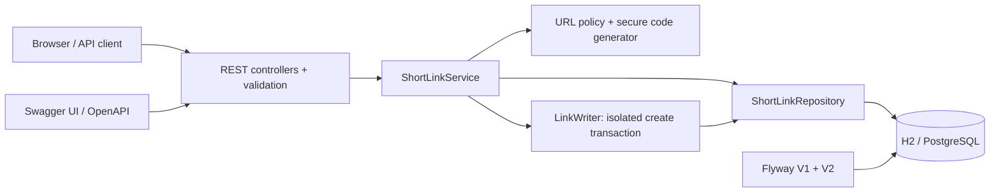

# Architecture and decisions

## Components

Controllers translate HTTP into service calls. DTOs define API contracts independently of persistence entities. The service owns lifecycle and retry rules. The repository owns indexed lookups and atomic updates. A separate writer bean establishes a fresh transaction per insertion attempt; using a self-invoked method would bypass Spring's transaction proxy.

## Data model

`short_links` contains:

| Column | Purpose |
|---|---|
| `id` | UUID primary key, internal identity |
| `code` | Unique, case-sensitive public identifier, maximum 32 characters |
| `original_url` | Immutable destination, maximum 2048 characters |
| `created_at` | UTC creation instant |
| `expires_at` | Optional UTC expiration instant |
| `enabled` | Permanent deactivation flag |
| `click_count` | Nonnegative BIGINT aggregate |
| `last_clicked_at` | Latest accepted redirect time; null before first click |

A unique index on `code` serves lookups and enforces allocation. V1 creates the baseline; additive V2 introduces lifecycle and analytics with safe defaults for existing rows. Schema validation runs at startup; the app does not use Hibernate `update` or `create` in normal operation. PostgreSQL's default case-sensitive varchar equality is assumed; do not substitute case-insensitive types/collations without revisiting alias semantics.

## Creation flow

1. Validate the URL, alias and expiration; normalize timestamps to microseconds.
2. Use the custom alias or generate eight characters using `SecureRandom` over 62 symbols (62^8 possibilities, approximately 47.6 bits).
3. Insert and flush within a new transaction. The unique constraint arbitrates concurrent allocation.
4. Return 201 after commit. For a generated collision, retry up to five attempts. For a custom-alias collision, return 409.
5. Other integrity failures propagate as storage errors rather than being silently mistaken for collisions.

A pre-insert existence check alone would have a race. Collision checks after rollback identify the existing code; the separate transaction prevents a retry from running inside a rollback-only transaction. Eight characters provide a compact identifier space, not an authentication secret.

## Redirect and analytics flow

A transactional conditional UPDATE increments `click_count` only when the link is enabled and not expired at the sampled instant. It also sets `last_clicked_at` to the greater of the old and sampled values. This prevents lost increments and timestamp regression when requests commit out of order or the clock moves backward.

An indexed lookup retrieves the immutable destination. A zero-row update is resolved to 404 for missing links or 410 for inactive links. The transaction commits before the controller returns 302 with `Cache-Control: no-store`.

GET counts; HEAD validates and returns the redirect without modifying the row. Metadata and analytics remain available after expiry or deactivation. In-flight requests admitted before a transition may finish afterward. The database count may include a request whose client disconnects after commit; exactly-once browser delivery is not claimed.

**Trade-off:** synchronous counters introduce a database write for each redirect and serialize updates to a popular link. This is appropriate for a small, understandable prototype. An event queue or sharded counters would improve throughput but introduce eventual consistency, event deduplication and operational complexity. No cache is introduced until that consistency policy is intentionally redesigned.

## Reliability and failure behavior

- Database constraints establish uniqueness and nonnegative counts.
- Transactions keep redirect admission and counting consistent.
- Generated collision retries are bounded; storage failures return 503.
- Database outages stop redirects rather than returning uncounted cached destinations.
- Hikari connection pooling is provided by the starter; capacity/timeouts remain framework defaults.
- Health reports availability; only health and info are exposed through Actuator.
- Graceful shutdown permits in-flight request completion.
- File-backed H2 survives local restarts; PostgreSQL Compose uses a persistent volume.
- H2 supports a single local app process; use PostgreSQL for multiple instances.
- `last_clicked_at` is a UTC instant but consistent time across application nodes requires clock synchronization.

## Security and privacy boundaries

HTTP(S)-only URL parsing rejects credentials, malformed authorities, oversized values and literal control characters. The server never fetches destinations, so redirects do not create a server-side fetching SSRF path. Private/loopback destinations are allowed; abuse prevention and destination trust are not solved by syntactic URL validation.

Returned short URLs use a configured canonical base URL, not untrusted Host/Forwarded headers. Exceptions do not include SQL details in client responses. Application error logging records database exception types without submitted URLs; ORM/database diagnostic logs still require operational access controls and review. The application stores no visitor IP, user-agent, referrer or per-click event.

There is no authentication, authorization or rate limiting. Anyone with network access can create, inspect or disable links. That is a documented local/demo limitation; public deployment requires identity/ownership checks, abuse controls, TLS, protected secrets, monitoring and a backup/restore exercise. Swagger and management endpoints should be reviewed for deployment exposure. The local Compose ports bind to 127.0.0.1.

## Dependencies and scope choices

- Retained the Boot 4 starter and selected compatible imports and dependencies.
- Used springdoc 3.1.1, the Boot 4 generation documented at https://springdoc.org/.
- Used existing Lombok narrowly: entity getters, JPA no-args constructor, constructor injection. Entities do not use `@Data` or mutable generated setters.
- Used H2 for zero-install tests and development; kept the PostgreSQL driver and added Flyway's PostgreSQL module.
- Retained DevTools for development; Boot packaging excludes it from the executable jar.
- Added JaCoCo to make coverage inspectable; coverage is evidence, not proof of correctness.
- Rejected premature cache/Redis/queue additions because current correctness is clearer with one database source of truth.

## Deployment evolution

First add authentication/ownership and ingress rate limits. Then validate PostgreSQL under realistic concurrent load, configure connection/request deadlines, and measure hot-link contention. Introduce caching or asynchronous counters only with an explicit count consistency contract. Add backups, retention, alerts and controlled migrations before public release. A multi-region or high-availability claim would require substantially more evidence than this prototype provides.
